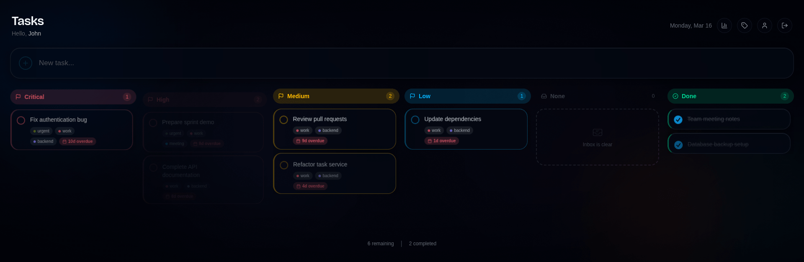
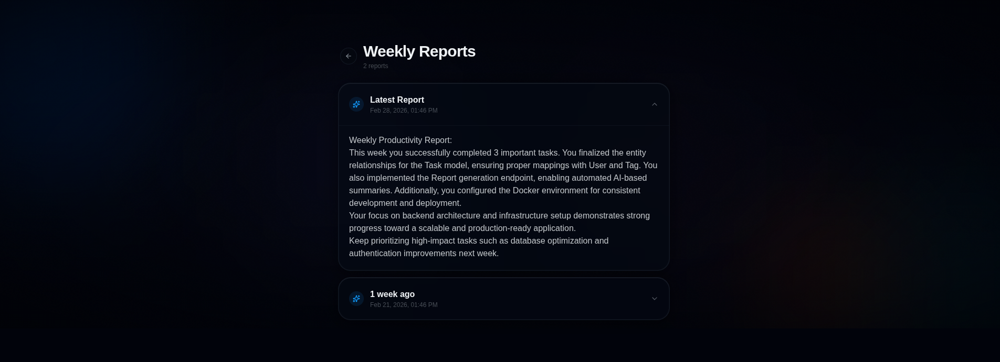

# Smart Task Management with AI Insights




## Vision
A task management app that not only helps users organize tasks but provides 
weekly AI-powered insights to improve productivity patterns.

## Target Users
- Professionals managing work/personal tasks
- Students tracking assignments
- Anyone wanting to improve productivity

## Frontend:
  - Framework: React with Vite
  - UI Library: Tailwind CSS

## Backend:
  - Framework: Spring Boot 3.x
  - Java Version: 21 LTS
  - Build Tool: Maven
  - Security: Spring Security + JWT
  - Database: PostgreSQL
  - API: RESTful
  - AI Integration: Google AI / Open Router

Infrastructure:
  - Container: Docker
  - Orchestration: Docker Compose (dev)

## User Stories
- As a user, I want to create an account so my tasks are private
- As a user, I want to create, edit, and delete tasks
- As a user, I want to mark tasks as complete
- As a user, I want to set due dates and priorities
- As a user, I want to organize tasks with tags/categories

### AI Features
- As a user, I want weekly reports showing my productivity patterns
- As a user, I want AI suggestions on how to improve task completion
- As a user, I want to know which tasks I typically procrastinate on

## REST Endpoints

Base path:

```
/api
```

### Authentication

```
POST   /auth/register
POST   /auth/login
POST   /auth/refresh-token
```

### Tasks

```
GET    /tasks/me
GET    /tasks/me/{id}
POST   /tasks
PUT    /tasks/me/{id}
PATCH  /tasks/me/{id}
DELETE /tasks/me/{id}
```

### Tags

```
GET    /tags/me
POST   /tags
DELETE /tags/me/{id}
```

### AI Reports

```
GET    /reports/me
GET    /reports/me/latest
```

All endpoints (except `/auth/**`) require a valid JWT:

```
Authorization: Bearer <token>
```
